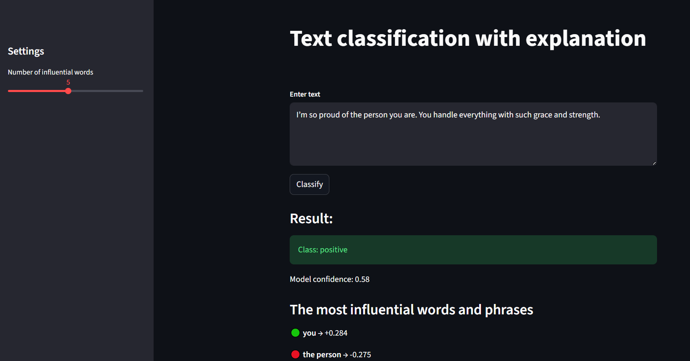

# Text Classification with Explainability  
*(TF-IDF + Logistic Regression + SHAP)*

End-to-end machine learning project for binary sentiment classification of text with interpretable predictions.
The project includes a reproducible training pipeline, model evaluation, SHAP-based explainability, and a public Streamlit application.

---

## Live Demo

The application is publicly available and requires no setup:

**[Open Streamlit App](https://text-classifier-explainable-ch6n3ty7mkoqdkoeeubyqo.streamlit.app/)**

Users can enter arbitrary text, get a sentiment prediction, model confidence, and see the most influential words and phrases that affected the decision.

 

---
## Table of Contents
- [Text Classification with Explainability](#text-classification-with-explainability)
  - [Live Demo](#live-demo)
  - [Table of Contents](#table-of-contents)
  - [Project Overview](#project-overview)
  - [Motivation \& Use Cases](#motivation--use-cases)
  - [Data](#data)
  - [Language Support \& Limitations](#language-support--limitations)
  - [Repository Structure](#repository-structure)
  - [Design Principles](#design-principles)
  - [Data and Models](#data-and-models)
  - [Local Setup](#local-setup)
    - [Requirements](#requirements)
    - [1. Create a virtual environment](#1-create-a-virtual-environment)
    - [2. Install dependencies](#2-install-dependencies)
    - [3. Download dataset](#3-download-dataset)
    - [4. Train model](#4-train-model)
    - [5. Build SHAP explainer](#5-build-shap-explainer)
    - [(Optional) Evaluate model](#optional-evaluate-model)
    - [6. Run the application](#6-run-the-application)
  - [Streamlit Application](#streamlit-application)
  - [Explainability](#explainability)
  - [Notebooks](#notebooks)
  - [Key metrics](#key-metrics)
  - [Code Quality](#code-quality)
  - [Tech Stack](#tech-stack)
  - [Notes](#notes)
  - [License](#license)
---

## Project Overview

This project demonstrates a complete ML workflow for text classification:

- Binary sentiment classification (*positive / negative*)
- Text vectorization using **TF-IDF**
- Classification with **Logistic Regression**
- Local model explainability using **SHAP**
- Reproducible execution via standalone scripts
- Interactive inference and explanations via **Streamlit**

The project is intentionally structured to clearly separate:
- reusable ML logic (`src/tce`)  
- orchestration scripts (`scripts/`)  
- exploratory notebooks (`notebooks/`)  
- application-level code (`app.py`) 

---

## Motivation & Use Cases

This application can be used for **text sentiment analysis** in a variety of contexts, such as:

- **Customer feedback**: Quickly assess whether reviews or comments are positive or negative.  
- **Product or service monitoring**: Track public sentiment over time to identify trends or potential issues.  
- **Content moderation**: Detect negative or harmful sentiment in user-generated content.  
- **Educational purposes**: Learn how TF-IDF, Logistic Regression, and SHAP work together in a complete ML pipeline.  
- **Prototyping NLP solutions**: Serve as a reusable starting point for other text classification tasks.

The interactive Streamlit app allows users to explore **predictions and explanations** without setup, making it accessible to both technical and non-technical users.

---

## Data

The model is trained on the **IMDb Large Movie Review Dataset**:

- Source: [IMDb dataset](https://ai.stanford.edu/~amaas/data/sentiment/aclImdb_v1.tar.gz)  
- Task: binary sentiment classification (`positive` / `negative`)

The dataset is **not included in the repository** due to its size.
It is downloaded automatically via a dedicated script.

---

## Language Support & Limitations

⚠️ This model was trained exclusively on English movie reviews from the IMDb dataset.

- The application supports **English language input only**.
- Predictions for texts written in other languages may be meaningless or misleading.
- This limitation comes from the TF-IDF vectorizer and vocabulary built only on English data.

---

## Repository Structure

artifacts/

├── evaluation_report/

│ ├── figures/ # ROC and PR curves

│ └── model_metrics.json # Evaluation metrics

├── notebooks_artifacts/ # Outputs from notebooks, generated locally via notebooks execution

config/

├── model.json # Model hyperparameters

├── paths.json # Centralized paths configuration

data/ # Data directory, generated locally

models/ # Generated locally (not versioned)

├── model.joblib

└── explainer.joblib

notebooks/

├── 01_eda.ipynb

├── 02_preprocessing_and_training.ipynb

└── 03_explainability.ipynb

scripts/

├── load_data.py # Download and prepare dataset

├── train_model.py # Train and save model

├── build_explainer.py # Build SHAP explainer

└── evaluate_model.py # Evaluate model on test set

src/tce/

├── data.py # Data loading and preprocessing

├── model.py # Pipeline construction and inference

├── evaluate.py # Metrics computation and plots

├── explain.py # SHAP-based explainability

└── utils.py # Logging and helper utilities

app.py # Streamlit application


---

## Design Principles

- **No data or models in version control**
- **Reproducible scripts** for every pipeline step
- **Reusable ML logic** isolated in a Python package (`src/tce`)
- **Clear separation** between experimentation, training, and deployment
- **Explainability-first** approach

---

## Data and Models

- The dataset is downloaded via `scripts/load_data.py`
- Trained model and SHAP explainer are saved locally
- Neither data nor models are committed to the repository

This keeps the repository lightweight while preserving full reproducibility.

---

## Local Setup

### Requirements

- Python **>= 3.10**
- CPU-only (no GPU required)

### 1. Create a virtual environment
```bash
python -m venv venv
source venv/bin/activate  # Linux/macOS
venv\Scripts\activate     # Windows
```

### 2. Install dependencies

```bash
python -m pip install --upgrade pip
pip install -e .
pip install -r requirements.txt
```

### 3. Download dataset
```bash
python scripts/load_data.py
```

### 4. Train model
```bash
python scripts/train_model.py
```

### 5. Build SHAP explainer
```bash
python scripts/build_explainer.py
```

### (Optional) Evaluate model
```bash
python scripts/evaluate_model.py
```

Evaluation artifacts (metrics and plots) will be saved to `artifacts/evaluation_report/`.

### 6. Run the application
```bash
streamlit run app.py
```

---

## Streamlit Application

The application allows the user to:

1. Manually input text

2. Obtain:

- predicted class (positive / negative)

- model confidence

3. Inspect explanations:

- top influential words and phrases

- contribution sign and magnitude (SHAP values)

The number of displayed influential tokens can be adjusted via the sidebar.

The model and explainer are trained automatically on application startup and cached for reuse.

---

## Explainability

Model decisions are explained using SHAP:

- per-sample explanations

- token-level contribution scores

- clear distinction between positive and negative influence

Explanations are available:

- interactively in the Streamlit app

- in exploratory notebooks

---

## Notebooks

The `notebooks/` directory contains exploratory and experimental work:

- exploratory data analysis (EDA)

- feature inspection and hyperparameter selection

- explainability visualization

Notebook outputs are stored separately in artifacts/notebooks_artifacts/
and are not part of the production pipeline.

---

## Key metrics

| Metric   | Value |
| -------- | ----- |
| Accuracy | 0.91  |
| F1-score | 0.91  |
| ROC AUC  | 0.97  |

---

## Code Quality

- Type hints across all modules

- Centralized logging

- Explicit error handling

- Entry-point guarded scripts

- Modular and testable design

---

## Tech Stack

- Python

- scikit-learn

- SHAP

- Streamlit

- joblib

---

## Notes

This project was developed as a personal ML portfolio project with a focus on:

- interpretability,

- reproducibility,

- clean project structure.

---

## License

This project is licensed under the MIT License – see the LICENSE file for details.
